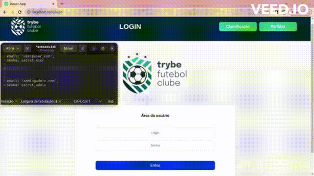

# Brasileirão Status F.C.

<!-- PROJECT LOGO -->

  <h3 align="center">Brasileirão Status F.C.</h3>
    
Info de Partidas e classificações de futebol a sua disposição

  
  

    
  

  
   
  
  <!-- 

    <a href="https://project-delivery-app-blue.vercel.app/login"><strong>NAVEGUE NA VERSÃO DEMO WEB »</strong></a>
  
 -->

<!-- TABLE OF CONTENTS -->

  
Índice

  <ol>
    <li>
      <a href="#sobre-o-projeto">Sobre o Projeto</a>
      <ul>
        <li><a href="#construído-com">Construído com</a></li>
      </ul>
    </li>
    <li><a href="#uso">Uso</a></li>
    <li><a href="#contato">Contato</a></li>
  </ol>

<!-- ABOUT THE PROJECT -->
## Sobre o Projeto

Desenvolvi uma plataforma Full-Stack com informativos das classificações e atual status dos times do Brasileirão em ReactJs e NodeJs!

Fui responsável por desenvolver uma API (utilizando o método TDD) e também integrar - através do docker-compose - as aplicações para que elas funcionem consumindo um banco de dados.

(<a href="#readme-top">Voltar ao Topo</a>)

### Construído com

* ![TypeScript]
* ![Node.js]
* ![Express.js]
* ![Sequelize]
* ![MySQL]

(<a href="#readme-top">Voltar ao topo</a>)

<!-- USAGE EXAMPLES -->
## Uso

Foi construído uma aplicação back-end dockerizado utilizando modelagem de dados através do Sequelize. No desenvolvimento foi respeitado as regras de negócio providas no projeto e a API é capaz de ser consumida por um front-end já provido nesse projeto.

Para adicionar uma partida é necessário ter um token, portanto a pessoa deve estar logada para fazer as alterações. Tem-se um relacionamento entre as tabelas teams e matches que fazem as atualizações das partidas.

O back-end implementa as regras de negócio para popular adequadamente a tabela disponível no front-end que será exibida para a pessoa usuária do sistema.

(<a href="#readme-top">Voltar ao topo</a>)

<!-- CONTACT -->
## Contato

Edmilson Corrêa - edm.correa@hotmail.com

Link do Projeto: https://github.com/edmcorrea/Futebol-Club-Project

(<a href="#readme-top">Voltar ao topo</a>)

<!-- MARKDOWN LINKS & IMAGES -->
[TypeScript]: https://img.shields.io/badge/typescript-%23007ACC.svg?style=for-the-badge&logo=typescript&logoColor=white
[Node.js]: https://img.shields.io/badge/node.js-6DA55F?style=for-the-badge&logo=node.js&logoColor=white
[Express.js]: https://img.shields.io/badge/express.js-%23404d59.svg?style=for-the-badge&logo=express&logoColor=%2361DAFB
[Sequelize]: https://img.shields.io/badge/Sequelize-52B0E7?style=for-the-badge&logo=Sequelize&logoColor=white
[MySQL]: https://img.shields.io/badge/mysql-%2300f.svg?style=for-the-badge&logo=mysql&logoColor=white
